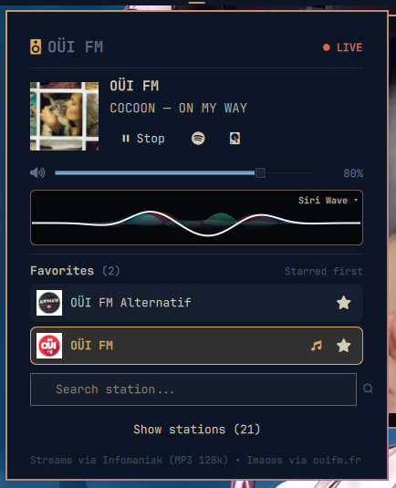

# OUI FM for Omarchy

An [Omarchy](https://omarchy.org) plugin to listen to **OUI FM** and its 20 webradios directly from the desktop. OUI FM is a French rock radio — the plugin streams the national feed and all thematic webradios with live track info, cover art and audio visualization.



## Features

- **21 stations** — OUI FM (national) + 20 webradios: Classic Rock, Rock Inde, Alternatif, Top of the Week, Garage Rock, Girls Rock, Rock Francais, Blues'n'Rock, Bring The Noise, Acoustic, Generation Woodstock, Les Slows du Rock, Reggae, Rock 60s / 70s / 80s / 90s / 2000, Summertime, Rock'n'Food. See [ouifm.fr](https://www.ouifm.fr/).
- **Bar widget + floating panel** — bar icon shows live state, click to open the panel. The panel can also be summoned as a floating window via IPC.
- **Now playing** — station vignette on the left, live track on the right (artist — title + cover from `TitleDiffusions` API), Play/Stop, Spotify search and Send to Sonos actions.
- **Audio visualizer** — real FFT via `parec`/`pw-record` + `spectrum.py` (same engine as Omaramp), rendered on a Canvas. Three modes only: Siri Wave, Sine Wave, Liquid Plasma. Click the visualizer or the mode label to cycle.
- **Favorites** — star any station, favorites are pinned first and shown in a dedicated section above search. Persisted to `state.json`.
- **Search** — filter stations by name, favorites remain pinned within results.
- **Collapsible list** — collapsed by default, expands to a scrollable viewport showing 3.5 rows (remaining stations scroll). Current station highlighted with accent border.
- **Volume + persistence** — slider controls mpv volume via IPC (`socat`), falls back to `--volume` on next play. Volume, last station and favorites are persisted to `~/.config/omarchy-ouifm/state.json`.
- **Spotify** — one-click search for the current track on Spotify (no auth, opens `open.spotify.com/search/` in the browser).
- **Sonos** — one-click send to Sonos. If `omasonos` is installed and the station exists as a Sonos favorite (TuneIn), it plays that favorite via `OmaSonos` (`playFavorite`). Otherwise it falls back to direct `play_uri` via `soco` discovery (no extra config if OmaSonos is set up).

## Installation

```bash
omarchy plugin add https://github.com/tug-benson/omarchy-ouifm --enable
```

Or symlink during development:

```bash
ln -s /path/to/omarchy-ouifm ~/.config/omarchy/plugins/io.github.tug-benson.omarchy-ouifm
omarchy-shell shell rescanPlugins
```

To remove:

```bash
omarchy plugin remove io.github.tug-benson.omarchy-ouifm
```

## Dependencies

```bash
sudo pacman -S mpv socat curl python3 python-numpy
# optional for Sonos:
# soco is provided by the OmaSonos venv at ~/.local/share/io.github.ctl0v0.omasonos/venv
# optional for visualizer capture: pipewire-pulse or pulseaudio (parec), or pipewire (pw-record)
```

- `mpv` — audio playback (`--no-video --input-ipc-server`).
- `socat` — JSON IPC to mpv for live volume changes.
- `curl` + `python3` — track metadata via `ouifm.fr/api/TitleDiffusions` and `mpv` fallback.
- `python-numpy` — optional, speeds up FFT in `spectrum.py` (pure Python fallback exists).
- `parec` (pulseaudio/pipewire-pulse) or `pw-record` (pipewire) — audio capture for the visualizer.
- `soco` — optional, only for Send to Sonos. Installed automatically with OmaSonos; otherwise `pip install soco`.

All streams are public MP3 128k at `*.ice.infomaniak.ch`; cover art comes from `bocir-medias-prod` and `lesindesradios.fr` (TitleDiffusions).

## Usage

1. Click the radio icon in the bar to open the panel (or `omarchy-shell shell summon io.github.tug-benson.omarchy-ouifm '{}'`).
2. The top card shows the current station cover (or live track cover) and track. Use Play/Stop, Spotify search and Sonos send.
3. Adjust volume with the slider.
4. Click the visualizer or its label to cycle Siri Wave / Sine Wave / Liquid Plasma.
5. Favorites are shown above search; click the star on any station to pin it.
6. Use search to filter stations, then expand the list to pick a station. Clicking the playing station stops it.

## How it works

- `Service.qml` — station catalogue (`id`/`idMds`/`label`/`stream`/`image`/`altCover`), `mpv` lifecycle (`/tmp/omarchy-ouifm-mpv.sock`), `TitleDiffusions` polling (15s) with `soco`/`mpv` fallback, spectrum daemon (`spectrum.py`), Sonos helper (`bin/omarchy-ouifm-sonos`), Spotify search. State persisted to `state.json`.
- `BarWidget.qml` + `BarPanel.qml` — bar icon + `KeyboardPanel` popover.
- `Panel.qml` — floating `PanelWindow` for `kind: panel`.
- `OuifmContent.qml` — shared UI: title, now playing, volume, visualizer (Canvas + FileView on `.../omarchy-ouifm/spectrum.json`), favorites, search, collapsible list.
- `spectrum.py` + `visualizers/` — FFT capture and three JS renderers (siriwave, sine, plasma) reused from Omaramp but scoped to `omarchy-ouifm`.
- `bin/omarchy-ouifm-sonos` — fallback helper that discovers Sonos via `soco.discover()` and calls `play_uri` (used when no OmaSonos favorite matches).

No secrets are stored. No privileged operations.

## Layout

```
omarchy-ouifm/
├── manifest.json
├── Service.qml
├── BarWidget.qml
├── BarPanel.qml
├── Panel.qml
├── OuifmContent.qml
├── spectrum.py
├── visualizers/
│   ├── helpers.js
│   ├── siriwave.js
│   ├── sine.js
│   └── plasma.js
├── bin/
│   └── omarchy-ouifm-sonos
├── README.md
├── LICENSE
└── preview.png
```

## License

MIT — see [LICENSE](LICENSE).
